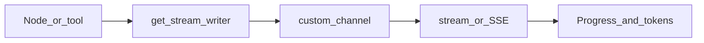

# Custom Stream Channels

## 30-second answer

Built-in stream modes say which node ran. Custom channels let a node push its own progress via `get_stream_writer()`. Under `stream_mode="custom"` (or combined modes) those events reach the client. Under `invoke` the writer is a **no-op**. Map custom/messages/updates onto SSE `data:` JSON lines. Throttle high-volume loops. Never put secrets in custom events.

## Tiny example

Research desk gather node: emit `start`, then "searching 47 documents," intermittent hits, then `done`. The chat UI shows what is happening instead of a frozen spinner. Combine with `messages` so the answer types out while progress updates.

## Why it exists

Notebook 33 covered built-in modes. They cannot say "found 3 of 5 facts" or "CRM is slow." Custom events turn a spinner into an interface that explains itself. Same writer works inside tools and subgraphs.

## Runtime



*Picture:* node pushes progress on a side channel; state reducers stay separate.

1. Call `get_stream_writer()` inside a node. No-op under plain `invoke`.
2. Prefer a typed event shape (`kind`: stage / progress / finding / warning / metric).
3. Combine: `stream_mode=["custom", "messages"]` → `(mode, payload)`.
4. Works inside `@tool` functions while `ToolNode` runs.
5. Child custom events surface on the parent; `subgraphs=True` adds namespace.
6. SSE: yield `data: {json}\n\n` for progress, token, node. Terminal `done` in notebook 53.
7. Throttle: ~20 progress events even for 5,000 items. Whitelist fields.

## Objects, fields, and merge rules

| Piece | Role |
|---|---|
| `get_stream_writer()` | Emit fn; no-op under `invoke` |
| `stream_mode="custom"` | Custom payloads only |
| Combined modes | Tagged `(mode, payload)` |
| `ProgressEvent.kind` | UI discriminator |
| SSE `data: ...\n\n` | EventSource wire format |

Custom events do **not** merge into graph state. Reducers on state stay independent.

## Control surface

- Freeze a small set of event kinds before shipping UI.
- Cap event volume; whitelist fields; never emit secrets.
- Combine modes when you need narration plus typing.

## Failure anatomy

| Failure | Cause | Fix |
|---|---|---|
| Writer silent | Using `invoke` | Expected; use stream |
| Flooded client | Per-item emit | Throttle |
| Leaked secrets | Full internal dict | Whitelist |
| Proxy buffers SSE | nginx buffering | `X-Accel-Buffering: no` (53) |

## Keywords

- **`get_stream_writer`** — custom progress; no-op under invoke
- **`stream_mode="custom"`** — receive those events
- **SSE** — `data:` JSON lines for browsers
- **throttle / whitelist** — volume and safety

## Minimal fragment

```python
from langgraph.config import get_stream_writer

def gather(state):
    writer = get_stream_writer()
    writer({"kind": "stage", "message": "Searching documents"})
    for i, doc in enumerate(state["documents"], 1):
        if i % 10 == 0:
            writer({"kind": "progress", "current": i, "total": len(state["documents"])})
    writer({"kind": "done"})
    return {"sources": state["documents"][:5]}

# for mode, payload in graph.stream(inputs, stream_mode=["custom", "messages"]):
#     ...
```

## Interview traps

**Shallow:** "`get_stream_writer` is broken because invoke shows nothing."

**Correction:** It is intentionally a no-op under `invoke`. Use stream/astream.

**Shallow:** "Custom events update graph state."

**Correction:** Side channel only. State still uses reducers.

## Lab

[42_custom_stream_channels.ipynb](../../07-langgraph-advanced/42_custom_stream_channels.ipynb)
