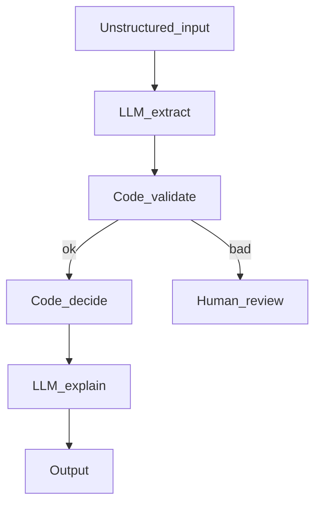

# Hybrid Deterministic and LLM Workflows

## 30-second answer

**The model interprets; code decides.** Extract or classify unstructured text with structured LLM output. Then apply policy, arithmetic, thresholds, and routing in pure Python. Use the model again only to explain computed figures. That split is cheaper, testable, identical across runs, and auditable for money and legal outcomes.

## Tiny example

Expense claim email → LLM extracts line items → Python applies hotel caps and approval threshold → LLM writes a polite explanation of the **already computed** total. The money path has no temperature.

## Why it exists

Asking the model to do arithmetic and policy couples extraction with judgement. You cannot unit-test the money path without an API key, and temperature can change the total. Hybrid moves risk to extraction, then guards that boundary with validation.

## Runtime



*Picture:* model reads and writes prose; code owns numbers and policy.

| Give it to the model | Give it to code |
|---|---|
| Understanding unstructured text | Arithmetic |
| Classification and intent | Policy thresholds |
| Explaining computed figures | Money / legal consequences |

**Claim pipeline:** extract (`with_structured_output`) → validate → `apply_policy` (pure Python) → explain (LLM, no recalculation).

**Classify then route:** structured sentiment → four `if`s to legal / account director / senior support / standard queue.

**Cheap gates:** reject empty, oversized, or injection-pattern input before any model call.

**Verify and retry:** SQL generate → code checks → feed errors back; cap attempts.

Pattern: `unstructured → [LLM] extract → [code] validate → [code] decide → [LLM] explain`.

## Objects, fields, and merge rules

| Field | Owner | Merge |
|---|---|---|
| `claim` | LLM extract | replace |
| `line_items`, `total_inr`, `needs_approval` | Code policy | replace |
| `validation_errors` / `trace` | Validator / all | append |
| `route` | Code decide | replace |

## Control surface

- Audit test: if a regulator asked you to prove the decision, could you? If not, it belongs in code.
- Validate extraction before policy.
- Unit-test policy without an API key.
- Never let the explain step recalculate.

## Failure anatomy

| Failure | Cause | Fix |
|---|---|---|
| Total drifts across runs | Model computed money | Move math to code |
| Untestable policy | Logic buried in prompts | Pure Python decision node |
| Bad extract slips through | No validate step | Route to human_review |

## Keywords

- **hybrid** — model interprets; code decides
- **structured extract** — risk at the boundary
- **policy in Python** — auditable money path
- **explain only** — LLM narrates computed figures

## Minimal fragment

```python
# extract: model.with_structured_output(Claim)
# apply_policy: pure Python hotel caps, meal caps, needs_approval = total > THRESHOLD
# explain: LLM writes prose from line_items — must not recalculate
# route: if mentions_legal: legal_team elif churn and account >= 50k: account_director ...
```

## Interview traps

**Shallow:** "Just ask the model for the reimbursable total."

**Correction:** Extraction + Python policy. Money must be identical every run and unit-testable.

**Shallow:** "Hybrid means the model and code take turns randomly."

**Correction:** Fixed split: interpret → validate → decide → explain.

## Lab

[43_hybrid_deterministic_llm.ipynb](../../07-langgraph-advanced/43_hybrid_deterministic_llm.ipynb)
