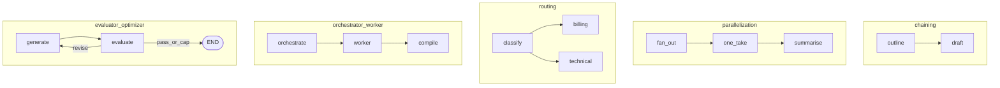

# Five Workflow Patterns

## 30-second answer

Name the pattern before inventing a graph: **prompt chaining** (fixed sequence), **parallelization** (fixed fan-out then reduce), **routing** (classify to one specialist), **orchestrator-worker** (dynamic `Send` from a model-produced plan), **evaluator-optimizer** (generate ↔ critique until passable or capped). Patterns 1–3 are familiar; 4 and 5 fill the catalogue gaps.

## Tiny example

Research desk brief:

- Fixed outline→draft → **chaining**
- Score on four known rubrics → **parallelization**
- Billing vs technical ticket → **routing**
- Report with N sections from a brief → **orchestrator-worker** (`Send`)
- Draft until critic approves → **evaluator-optimizer**

## Why it exists

Once you can name the pattern, design reviews take ten seconds. You stop reinventing the same diagram each sprint. Orchestrator-worker handles unknown N. Evaluator-optimizer is the writing-desk twin of reflective RAG (48) and the research desk reviewer (52).

## Runtime



*Picture:* the five workflows — pick one before drawing custom edges.

1. **Chaining** — `add_sequence`; every input takes the same steps.
2. **Parallelization** — fixed list of `Send`s; append reducer; summarise.
3. **Routing** — structured destination → one specialist → END.
4. **Orchestrator-worker** — model plans `sections`; dynamic `[Send("worker", ...)]`; length is runtime.
5. **Evaluator-optimizer** — generate ↔ critique; END if passable **or** `revisions >= MAX_REVISIONS`.

**Versus parallelization:** fixed list you wrote in code vs list the model produced.

Decision tree: fixed sequence? → chaining. Many independent subtasks? → known in code → parallelization, else orchestrator-worker. Quality loop? → evaluator-optimizer. Else → routing.

## Objects, fields, and merge rules

| Pattern | Key state | Merge / control |
|---|---|---|
| Chaining | `outline`, `draft` | replace |
| Parallel | `takes` | append + fixed Send |
| Routing | `destination` | replace |
| Orch-worker | `sections`, `completed` | dynamic Send + append |
| Eval-opt | `draft`, `revisions`, `critiques` | loop + caps |

`Send` payloads are per-worker slices, not necessarily full parent state.

## Control surface

- Name the pattern in design docs.
- Use dynamic `Send` only when the subtask list depends on the input.
- Cap evaluator-optimizer in **code**, not only in the critic prompt.
- Combine: route "quick" → chain, "polished" → evaluator-optimizer.

## Failure anatomy

| Failure | Fix |
|---|---|
| Orch-worker for 3 fixed rubrics | Use parallelization |
| Eval loop never ends | `MAX_REVISIONS` + `recursion_limit` |
| Over-engineered ticket triage | Routing or chaining |

## Keywords

- **five workflows** — chain, parallel, route, orch-worker, eval-opt
- **`Send`** — dynamic map for orchestrator-worker
- **dual exits** — passable or revision cap
- **fixed vs dynamic fan-out** — parallelization vs orch-worker

## Minimal fragment

```python
# Orchestrator-worker
def assign_workers(state):
    return [Send("worker", {"section": s, "topic": state["topic"]}) for s in state["sections"]]

# Evaluator-optimizer
def should_continue(state):
    if state["passable"] or state["revisions"] >= MAX_REVISIONS:
        return END
    return "generate"
```

## Interview traps

**Shallow:** "Orchestrator-worker and parallelization are the same."

**Correction:** Parallelization uses a fixed list in code. Orchestrator-worker uses a model-produced list and dynamic `Send`.

**Shallow:** "The critic prompt alone stops the eval loop."

**Correction:** Cap in code. Quality-only loops burn tokens.

## Lab

[43a_five_workflow_patterns.ipynb](../../07-langgraph-advanced/43a_five_workflow_patterns.ipynb)
