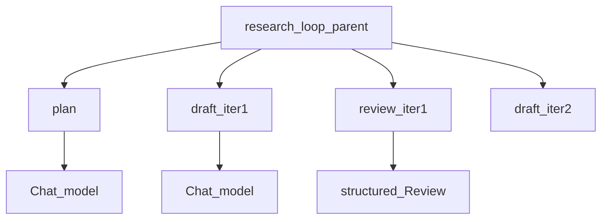

# LangSmith and LangGraph Studio

## 30-second answer

LangSmith records graph runs as nested traces: parent graph → node children → LLM/tool grandchildren. Pass `run_name`, `tags`, `metadata`, and `configurable.thread_id` (conversation id) on every invoke. Use `@traceable` for plain Python. Datasets for regression. `langgraph.json` + `langgraph dev` for Studio (edit state live). Offline, approximate with `stream_mode="updates"`. Never put secrets in tags or metadata.

Debugging order: rendered prompt → `finish_reason` → node path → tool/retriever I/O → token/latency waterfall → loop count.

## Tiny example

Research loop: plan → draft → review → maybe draft again. Trace shows two draft iterations, which node ate latency, and how many tokens the review structured call used. Studio lets you pause, edit priority, and fork the save game.

## Why it exists

`print` fails when twelve nodes loop. You need the execution tree. Notebook 19 taught LangSmith on chains; this applies it to graphs and adds Studio. Ship with some form of this discipline — at least offline `debug_run`.

## Runtime



*Picture:* one parent run nests every node and every model call — including loop iterations.

| Variable | Role |
|---|---|
| `LANGSMITH_TRACING=true` | Master switch |
| `LANGSMITH_API_KEY` | Auth |
| `LANGSMITH_PROJECT` | Project bucket |

Prefer `LANGSMITH_*` over older `LANGCHAIN_*` names.

Config keys: `run_name`, `tags`, `metadata` (include `prompt_version`), `configurable.thread_id`.

`@traceable` for plain Python scoring/I/O. `Client.list_runs` for scripts. Datasets + scorers for regression gates.

Studio via `langgraph.json` (`dependencies`, `graphs`, `env`). Export compiled graphs usually **without** your own checkpointer — Studio supplies one. `langgraph dev` starts local API + Studio.

Offline: `stream_mode="updates"` waterfall.

## Objects, fields, and merge rules

| Piece | Role |
|---|---|
| Nested spans | Graph → node → LLM/tool |
| `run_name` / tags / metadata | Readable, filterable traces |
| `langgraph.json` | Studio / Platform graph map |
| Dataset examples | `inputs` / `outputs` for regression |
| `debug_run` | Offline updates stream |

## Control surface

- Name every run; tag env and version.
- Sample in production; never log secrets.
- Regression gate on pass-rate before prompt changes ship.
- Use Studio for interrupt/edit/fork while learning.

## Failure anatomy

| Failure | Fix |
|---|---|
| All runs named `LangGraph` | Set `run_name` |
| Cannot find conversation | Pass stable `thread_id` |
| Secrets in metadata | Whitelist fields |
| No tracing offline | `stream_mode="updates"` |

## Keywords

- **LangSmith traces** — nested graph spans
- **Studio** — visual debugger via `langgraph.json`
- **`@traceable`** — plain Python spans
- **datasets / regression** — measurable quality
- **conversation id in config** — group turns

## Minimal fragment

```python
config = {
    "run_name": "research_loop",
    "tags": ["env:dev", "v1"],
    "metadata": {"prompt_version": "2026-03-01", "user_id": "u1"},
    "configurable": {"thread_id": "desk-42"},
}
graph.invoke(inputs, config)

# langgraph.json: "graphs": {"research_loop": "./app/graphs.py:research_graph"}
# langgraph dev
```

## Interview traps

**Shallow:** "Studio replaces LangSmith."

**Correction:** Studio is the live debugger; LangSmith is the durable trace store. They link.

**Shallow:** "Export graphs with your production checkpointer into Studio."

**Correction:** Studio/Platform usually supplies the checkpointer. Export without your own.

## Lab

[45_langsmith_and_studio.ipynb](../../07-langgraph-advanced/45_langsmith_and_studio.ipynb)
