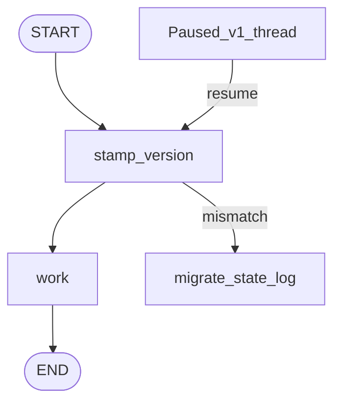

# Deployment and Versioning

## 30-second answer

A paused thread resumes against **today's code**. Stamp `graph_version` in state. Run `migrate_state` for schema renames. Node renames/removals break in-flight threads. One checkpointer per process; **SQLite one writer**; Postgres for multi-worker. Drive Studio/Platform with `langgraph.json`. Prefer FastAPI `ainvoke`/`astream` or Platform over historical LangServe for graphs.

## Tiny example

Support approval paused yesterday at `issue_refund`. You rename that node to `refund` and deploy. Resume today fails — the save game still points at the old name. Dual-version drain or finish in-flight threads first.

## Why it exists

A notebook graph and a serving graph are different artefacts. The second needs a durable checkpointer, HTTP surface, streaming, health checks, and a story for in-flight conversations when you deploy.

## Runtime



*Picture:* every resume hits the version stamp; migrate or fail loudly on mismatch.

| Option | Good for |
|---|---|
| Self-hosted FastAPI | Full control |
| LangGraph Platform | Fastest production API |
| Serverless | Low, bursty traffic |

**Compatibility for in-flight threads**

| Change | Safe? |
|---|---|
| Add optional state key | Yes |
| Change a prompt | Yes |
| **Rename / remove a node** | **No** |
| **Remove a state key / change reducer** | **No** |

**Workers vs checkpointer:** SQLite + 1 worker OK. SQLite + many workers → `database is locked`. Postgres + multi-worker = prod pattern.

CLI: `langgraph dev` / `build` / `up`. LangServe is historical for LCEL; graphs want FastAPI or Platform.

Safe rollout: classify change → regression → migrate → staging → canary → drain paused threads → watch approval queue.

## Objects, fields, and merge rules

| Item | Role |
|---|---|
| `graph_version` | Stamp in state |
| `migrate_state` | Rename keys, setdefaults |
| Checkpointer singleton | One per process (`lru_cache`) |
| `langgraph.json` | Studio / Platform entry |

## Control surface

- Version every graph; log mismatches.
- Treat node rename as a breaking deploy.
- Postgres when you scale workers.
- Rollback of code is easy; rollback of state is not — make new keys optional.

## Failure anatomy

| Failure | Fix |
|---|---|
| Resume after rename | Dual-version or drain first |
| `database is locked` | One SQLite writer or Postgres |
| Checkpointer per request | Singleton; exhausts pools |
| Lost threads on multi-process InMemory | Durable shared saver |

## Keywords

- **`graph_version` / migrate** — in-flight compatibility
- **breaking: node rename** — paused threads cannot resume
- **SQLite one writer** — Postgres for replicas
- **`langgraph.json`** — Platform / Studio
- **drain in-flight** — before breaking deploys

## Minimal fragment

```python
GRAPH_VERSION = "2026.03.01"

def stamp_version(state):
    existing = state.get("graph_version")
    if existing and existing != GRAPH_VERSION:
        state = migrate_state(state)  # renames, setdefaults
    return {"graph_version": GRAPH_VERSION, **state}

# Checkpointer: lru_cache singleton — PostgresSaver.setup() at deploy
# langgraph dev | build | up
```

## Interview traps

**Shallow:** "Deploy anytime; checkpoints are schema-free."

**Correction:** Node names and reducers are part of the resume contract.

**Shallow:** "SQLite with four uvicorn workers is fine."

**Correction:** SQLite one writer. Use Postgres for multi-worker.

## Lab

[46_deployment_and_versioning.ipynb](../../07-langgraph-advanced/46_deployment_and_versioning.ipynb)
