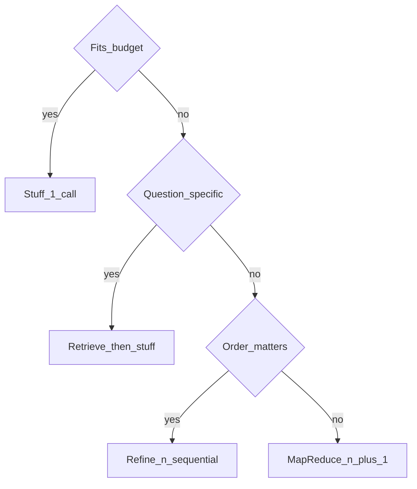

# Token Limits and Summarisation Strategies

## 30-second answer

Usable context is the window minus system prompt, tool schemas, output reserve, and safety margin — not the headline size. When content does not fit: **stuff** (1 call) if it fits; **retrieve + stuff** for specific questions; **map-reduce** (n+1, parallel map) for broad summaries; **refine** (n sequential) when order matters. Conversation compression should trigger on **tokens**, not message count.

## Tiny example

Research desk gets a 200-page contract. Specific question ("indemnity cap?") → retrieve top chunks then stuff. "Summarise the whole agreement" → map-reduce. Meeting transcript where order matters → refine.

## Why it exists

Notebook 37 managed conversation history. This covers content larger than the window no matter how you trim. Wrong strategy is why some summarisers cost $4 per document and others four cents.

## Runtime



*Picture:* decide by fit, specificity, and whether order matters.

| Strategy | Calls | Parallel | Use when |
|---|---|---|---|
| Stuff | 1 | n/a | It fits |
| Map-reduce | n+1 | Yes | Broad summary of large corpus |
| Refine | n | No | Narrative order matters |
| Retrieve+stuff | 1 (+ embed) | n/a | Specific questions — usually the answer |

Conversation summarisation node: token threshold → rolling `summary` + `RemoveMessage` older ids + keep recent N.

What survives summarisation: names, decisions, numbers if demanded. What is lost: exact wording, turn order, dropped ideas.

## Objects, fields, and merge rules

| Strategy | Where context is cut |
|---|---|
| Stuff | Nowhere (must fit) |
| Map-reduce | Per-chunk extract; reduce sees summaries |
| Refine | One chunk + running answer |
| Retrieve+stuff | At retrieval (top-k) |
| Chat compress | Older messages → `summary` |

`chunk_summaries: Annotated[list, operator.add]` appends parallel map outputs.

## Control surface

- Compute usable budget before choosing.
- Prefer retrieve+stuff for specific questions.
- Filter `NOTHING RELEVANT` map chunks before reduce.
- Trigger chat compression on tokens; use rolling summaries.

## Failure anatomy

| Failure | Fix |
|---|---|
| Expensive summariser on specific Q | Retrieve+stuff |
| Lost cross-chunk reasoning in map-reduce | Refine if order matters |
| Compress on message count | Trigger on tokens |

## Keywords

- **usable budget** — window minus reserves
- **stuff / map-reduce / refine / retrieve+stuff** — four strategies
- **token trigger** — not message count
- **rolling summary** — extend existing summary

## Minimal fragment

```python
def choose_strategy(tokens, question_specific, order_matters):
    if tokens <= usable_budget:
        return "stuff"
    if question_specific:
        return "retrieve_stuff"
    if order_matters:
        return "refine"
    return "map_reduce"

# map-reduce: Send per chunk → append chunk_summaries → reduce
# chat: if estimate_tokens(messages) > TRIGGER: summarise older + RemoveMessage
```

## Interview traps

**Shallow:** "Always map-reduce large documents."

**Correction:** Specific questions usually want retrieve+stuff. Map-reduce is for broad summaries.

**Shallow:** "Summarise when you have more than N messages."

**Correction:** Trigger on tokens. One message can be 4 or 4,000 tokens.

## Lab

[47_token_limits_and_summarization_nodes.ipynb](../../07-langgraph-advanced/47_token_limits_and_summarization_nodes.ipynb)
