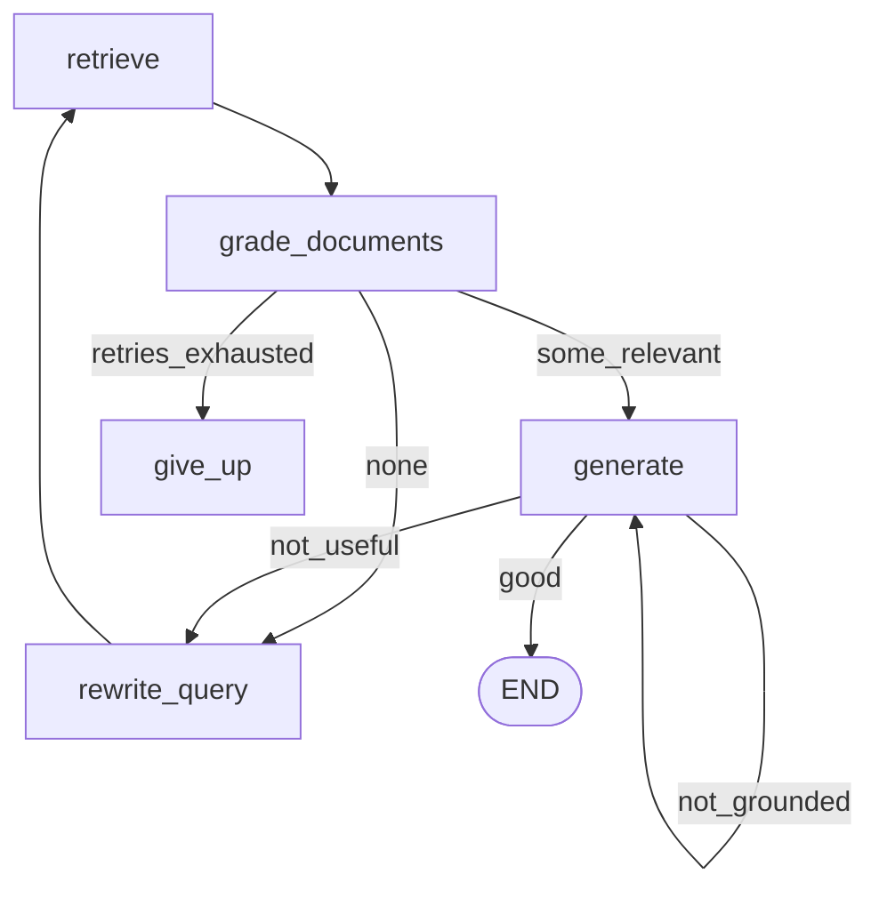

# Self-reflective RAG

## 30-second answer

Self-reflective RAG inserts graders after retrieve and after generate: document relevance, answer grounding, answer usefulness. Failures route to query rewrite, regenerate, web/external supplement (**CRAG**), or honest give-up — always with loop caps. **CRAG** adds corpus-level confidence → external fallback. **Adaptive** cheap-scores retrieval and only runs the expensive reflective path when weak. **Reflection (48a)** grades draft quality, not retrieval — different bottleneck.

## Tiny example

Policy chatbot: retrieve handbook chunks → grade each doc → if none relevant, rewrite query and retry (capped) → generate → if not grounded, regenerate → if still useless, give up honestly. Pet insurance question must refuse, not invent policy.

## Why it exists

Standard RAG retrieves once and answers from whatever it got — including irrelevant context — confidently. Graders are checkpoints. Correct refusals are the metric that justifies the extra calls.

## Runtime



*Picture:* retrieve → grade → generate or rewrite or give up. Caps on every loop.

| Grader | Asks |
|---|---|
| Relevance | Does this one document help? |
| Grounded | Is every claim in the docs? |
| Usefulness | Does the answer address the question? |
| Rewrite | Better search query in doc vocabulary |

Parallel grading: `Send("grade_one", ...)` + append reducer on `relevant`.

### CRAG vs reflection vs adaptive

| Variant | Focus |
|---|---|
| Reflective (main) | Doc relevance + grounding + usefulness |
| **CRAG** | Corpus confidence → supplement (web) + caveat |
| Adaptive | Cheap score → skip graders when retrieval looks strong |
| **Reflection (48a)** | Draft / answer quality, not retrieval |

Reflection often 4–8× plain RAG. Mitigate: small grader models; adaptive triage. Protect **correct refusals**.

## Objects, fields, and merge rules

| Field | Role |
|---|---|
| `documents` | Replaced by grade (keepers only) |
| `search_query` | Rewritten query |
| `retries` / `generations` | Append counters; caps |
| `confidence` / `supplemented` | CRAG |
| `trace` | Grader decisions for audit |

## Control surface

- Cap every loop.
- Grade docs individually; decide fallback corpus-wide.
- Caveat any externally supplemented answer.
- Adaptive triage before full reflection.

## Failure anatomy

| Failure | Fix |
|---|---|
| Invented policy | Reflective refuse / give_up |
| Infinite rewrite | `MAX_RETRIES` |
| 8× cost always | Adaptive triage |
| Confused with 48a | Retrieval bottleneck vs draft bottleneck |

## Keywords

- **self-reflective RAG** — graders after retrieve and generate
- **CRAG** — corpus confidence → external supplement
- **CRAG vs reflection** — retrieval quality vs draft quality (48a)
- **adaptive** — cheap score before expensive path
- **correct refusals** — ship metric

## Minimal fragment

```python
def route_after_grade(state):
    if state["relevant"]:
        return "generate"
    if state["retries"] >= MAX_RETRIES:
        return "give_up"
    return "rewrite"

# CRAG: if confidence != "high": supplement + caveat, then answer
# Adaptive: if faiss_score high → plain answer; else full reflective graph
```

## Interview traps

**Shallow:** "CRAG and reflection are the same loop."

**Correction:** CRAG is about corpus confidence and external fallback. Reflection (48a) critiques draft quality. Notebook 48 critiques retrieval/faithfulness.

**Shallow:** "Reflect on every query."

**Correction:** Adaptive triage. Most questions can skip graders.

## Lab

[48_self_reflective_rag.ipynb](../../07-langgraph-advanced/48_self_reflective_rag.ipynb)
