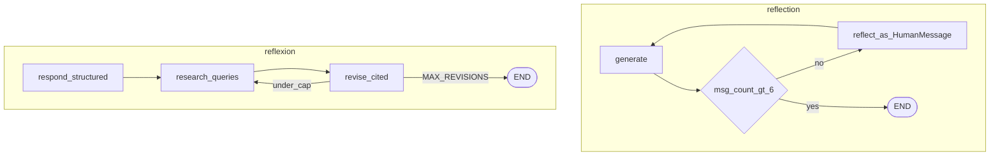

# Reflection and Reflexion Agents

## 30-second answer

**Reflection** loops generate ↔ critique over `MessagesState`, feeding critique back as a `HumanMessage`, stopping on a **message-count cap**. **Reflexion** uses structured self-critique that emits `search_queries`, runs research tools, then revises with citations. Notebook 48 reflects on **retrieval quality**; this lesson reflects on **draft / answer quality**. Pick for the actual bottleneck. That is the **CRAG vs reflection** fork at the product level: retrieval vs writing.

## Tiny example

Support email draft: writer produces a short reply; critic grades specificity and tone; critique returns as `HumanMessage`; writer revises. Cap at message count > 6. Or Reflexion for a research answer: structured critique emits search queries → research → revise with references.

## Why it exists

Same family as reflective RAG, different target. Reflection is evaluator-optimizer (43a) with a fixed critic persona. Reflexion adds tool-executed research when factual gaps — not wording — are the problem. Grade the wrong layer and you waste calls.

## Runtime



*Picture:* reflection is generate↔critique; Reflexion adds research tools driven by structured critique.

| Situation | Pattern |
|---|---|
| Draft quality (copy, email) | Reflection |
| Factual gaps (research) | Reflexion |
| Retrieved context is the bottleneck | Self-reflective RAG (48) / CRAG |
| Human must approve | Evaluator-optimizer + interrupt |

**Reflection:** critic output as `HumanMessage` so the writer revises instead of defending. Cap by `len(messages) > 6`.

**Reflexion schemas:** `Reflection` (missing/superfluous) → `AnswerQuestion` (answer + search_queries) → `ReviseAnswer` (references). `MAX_REVISIONS` stops the loop.

## Objects, fields, and merge rules

| Pattern | State | Stop |
|---|---|---|
| Reflection | `messages` + `add_messages` | Message-count cap |
| Reflexion | `latest`; `research` / `revisions` append | `MAX_REVISIONS` |
| Critique feed | Critic as `HumanMessage` | Not AIMessage |

## Control surface

- Cap reflection by message count.
- Keep Reflexion honest with structured `search_queries` and references.
- Do not confuse retrieval graders (48) with draft critics (48a).
- Feed critique as `HumanMessage`.

## Failure anatomy

| Failure | Fix |
|---|---|
| Infinite generate/reflect | Message-count cap |
| Vague "search more" | Structured `AnswerQuestion` |
| Writer defends draft | Critique as HumanMessage |
| Wrong notebook applied | Match bottleneck: 48 vs 48a |

## Keywords

- **reflection** — generate ↔ critique; message cap
- **Reflexion** — structured critique → research → revise
- **CRAG vs reflection** — retrieval/faithfulness vs draft quality
- **critique as HumanMessage** — writer revises, does not defend

## Minimal fragment

```python
def should_continue(state):
    return END if len(state["messages"]) > 6 else "reflect"

# reflect node returns {"messages": [HumanMessage(content=critique)]}
# Reflexion: respond (AnswerQuestion) → research(search_queries) → revise(ReviseAnswer)
# stop when revisions >= MAX_REVISIONS
```

## Interview traps

**Shallow:** "Use notebook 48 for bad marketing copy."

**Correction:** 48 grades retrieval. 48a grades draft quality. Match the bottleneck.

**Shallow:** "Feed the critique as an AIMessage."

**Correction:** HumanMessage — otherwise the writer defends its prior answer.

## Lab

[48a_reflection_and_reflexion.ipynb](../../07-langgraph-advanced/48a_reflection_and_reflexion.ipynb)
