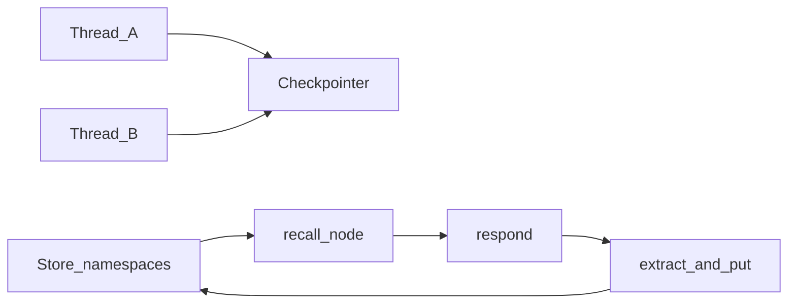

# Long-term Semantic Memory (Store)

## 30-second answer

The **checkpointer** holds whole graph state for one conversation id (`thread_id`). The **store** holds facts you deliberately save under namespaces — surviving new conversations. That is **store vs checkpoint**. Put tenant id first in the namespace from **auth**. `InMemoryStore` raises `NotImplementedError` on TTL; use `SqliteStore` / `PostgresStore` for durability and TTL sweeps.

## Tiny example

Support user says "We're the Kestrel team in ap-south-1." New conversation id tomorrow. Checkpointer is empty. Store still recalls the profile under `("org", org_id, "user", user_id, "facts")`. Respond node reads the store; remember node writes new durable facts.

## Why it exists

A checkpointer gives memory **within a thread**. Start a new conversation and everything is gone. Long-term memory is a store: thread-independent key-value space, optionally with semantic search. You almost always want both.

| | Checkpointer | Store |
|---|---|---|
| Scope | One conversation id | Any namespace |
| Holds | Whole graph state each step | Facts you deliberately saved |
| Written by | Framework, automatically | Your code, deliberately |
| Survives new conversation | No | Yes |

## Runtime



*Picture:* save games are per conversation; the store is the cross-conversation filing cabinet.

1. API: `put`, `get`, `search`, `delete`, `list_namespaces`.
2. Namespace = tuple of strings. Org/tenant first from auth — never from the model.
3. Semantic search: index on write; `search(..., query=)` ranks by meaning; combine with filters.
4. `compile(checkpointer=..., store=...)`. Nodes take `store` kwarg or `get_store()`.
5. Extract durable facts only; empty list is usually correct.
6. Reconcile before write: nearest neighbour → insert / update / skip.
7. TTL: InMemoryStore → `NotImplementedError`. Durable stores need `sweep_ttl()`.
8. Deleting a thread does not erase store namespaces unless you also delete them.

## Objects, fields, and merge rules

| Concept | Detail |
|---|---|
| Namespace | e.g. `("org", org_id, "user", user_id, "facts")` |
| Item | key, value, score on search |
| Memory kinds | profile, preference, decision, infrastructure, constraint |
| Privacy | export / delete; hard-coded secret gate |

## Control surface

- Tenant id from auth at front of namespace.
- Extract strictly; skip conversational noise.
- Search-before-write to avoid duplicates.
- Sweep TTL on durable stores.
- Hard-code secret gates — model instructions are suggestions.

## Failure anatomy

| Failure | Fix |
|---|---|
| Cross-tenant leak | Org first from auth |
| Noisy store | Empty-list-default extraction |
| TTL ignored | Not InMemoryStore; sweep durable stores |
| Secrets persisted | Code safety gate |

## Keywords

- **store vs checkpoint** — cross-thread facts vs per-conversation save game
- **namespace** — tenant-first tuple from auth
- **semantic search** — embed on put; rank on search
- **TTL sweep** — durable stores only; InMemory raises

## Minimal fragment

```python
# compile(checkpointer=saver, store=store)
def recall(state, *, store):
    hits = store.search(("org", org_id, "user", user_id, "facts"), query=state["question"])
    return {"memories": [h.value for h in hits]}

def remember(state, *, store):
    for fact in extract_durable_facts(state):  # empty list often correct
        store.put(("org", org_id, "user", user_id, "facts"), fact["key"], fact)
    return {}
# InMemoryStore TTL → NotImplementedError; SqliteStore/PostgresStore + sweep_ttl()
```

## Interview traps

**Shallow:** "The checkpointer is long-term memory."

**Correction:** Checkpointer is per conversation. Store is cross-conversation. Use both.

**Shallow:** "Put user id from the model's extraction into the namespace."

**Correction:** Tenant id from auth. Never from user input or model output.

## Lab

[49_long_term_semantic_memory.ipynb](../../07-langgraph-advanced/49_long_term_semantic_memory.ipynb)
