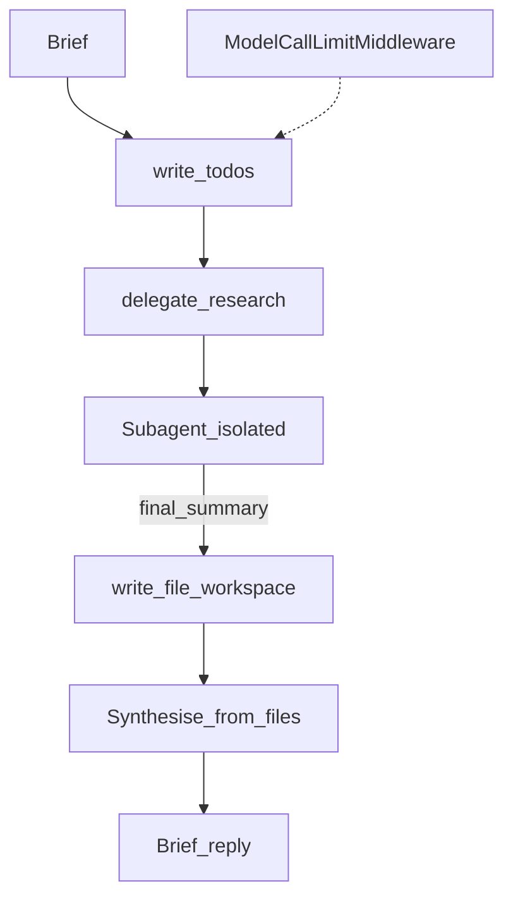

# Deep Agents

## 30-second answer

A deep agent is a tool-calling agent plus four capabilities: **planning** (`TodoListMiddleware` / `write_todos`), a **workspace** (files in state with a merge/append-style reducer), **subagents** (isolated histories; parent sees only the final summary), and a **harness** (long procedural system prompt). Cap model calls (`ModelCallLimitMiddleware`). Build from primitives first; the `deepagents` package bundles the same pillars. Use only when a competent human would need a plan, notes, and handoffs — often 5–20× a plain agent.

## Tiny example

Research desk brief: "Compare three competitors and write a positioning brief." Plan with todos → delegate research to subagents → write findings to files → synthesise from files → optional human click before `publish_brief`.

## Why it exists

A normal agent wanders, forgets what it did, fills context with raw tool output, and produces something shallow on long briefs. Deep agents assemble graph, state, tools, middleware, and store deliberately — none of it is new machinery.

| Capability | Problem it solves |
|---|---|
| Planning | Loses the thread across 30 steps |
| Workspace files | Findings do not fit in context |
| Sub-agents | One context polluted by every subtask |
| Harness prompt | Model does not know *how* you want the work done |

## Runtime



*Picture:* plan → isolated research → files → synthesise. Call limits on every path.

1. `TodoListMiddleware` — plan as visible state.
2. Workspace tools: `write_file` / `read_file` / `list_files` / `edit_file`. Files merge (not replace) so parallel writes coexist.
3. Subagent returns only final message content to parent.
4. Long procedural harness: plan first, delegate, write files, synthesise, cite figures, never invent.
5. Middleware stack: TodoList, workspace, summarisation, model call limit (`exit_behavior="end"`).
6. HITL only on irreversible tools (`publish_brief`), not cheap file writes.
7. Skills preview → full story in 50a.
8. Package `create_deep_agent` vs hand-built primitives — same four pillars.

| Signal | Build |
|---|---|
| Single lookup | Chain |
| Few tools, clear finish | Plain agent |
| Fixed steps / one approval | Graph (+ interrupt) |
| Open-ended, 10+ steps, big output | **Deep agent** |

## Objects, fields, and merge rules

| Piece | Role |
|---|---|
| `todos` | Plan items with status |
| `files: Annotated[dict, merge_files]` | Workspace merge, not replace |
| `ModelCallLimitMiddleware` | Hard stop on wandering |
| Subagent return | Final message only |

## Control surface

- Call limits on every deep agent and every subagent.
- Gate only irreversible / costly / customer-visible tools.
- Stream todos and file writes so long runs do not look hung.
- Cap delegation depth.

## Failure anatomy

| Failure | Fix |
|---|---|
| Shallow brief | Four capabilities |
| Unbounded bill | ModelCallLimitMiddleware |
| Lost parallel notes | merge_files reducer (not replace) |
| Context pollution | Subagent summaries only |
| Approval fatigue | Interrupt irreversible only |

## Keywords

- **four pillars** — plan, files, subagents, harness
- **merge files** — parallel workspace writes
- **final summary only** — subagent isolation
- **ModelCallLimitMiddleware** — hard stop
- **primitives vs package** — learn vs ship fast

## Minimal fragment

```python
# Middleware: TodoListMiddleware, workspace tools, SummarizationMiddleware,
# ModelCallLimitMiddleware(thread_limit=30, exit_behavior="end")
# Subagent: return only outcome["messages"][-1].content
# files channel uses a merge reducer — parallel writes append/merge, not replace
# HITL: HumanInTheLoopMiddleware(interrupt_on={"publish_brief": True})
```

## Interview traps

**Shallow:** "Deep agents are a new runtime."

**Correction:** Same graphs, state, tools, middleware. The product is the assembly.

**Shallow:** "Use a deep agent for every chatbot."

**Correction:** Only when a human would need a plan, notes, and handoffs. Otherwise chain/agent/graph.

## Lab

[50_deep_agents.ipynb](../../07-langgraph-advanced/50_deep_agents.ipynb)
