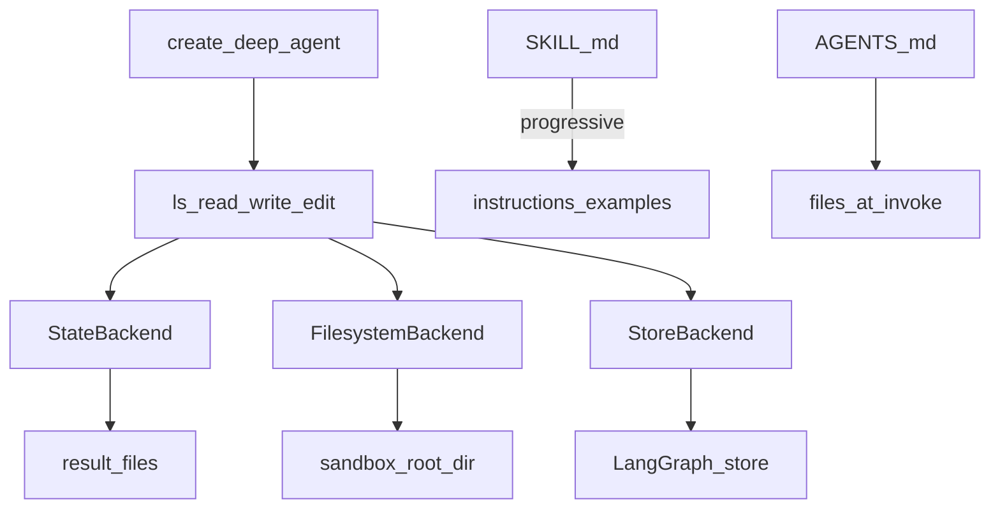

# Deep Agent Backends, Skills, and AGENTS.md

## 30-second answer

The packaged `deepagents` harness exposes the same file tools over three **backends**: **StateBackend** (bytes in graph state / `result["files"]`), **FilesystemBackend** (real disk under a sandbox root), **StoreBackend** (LangGraph store — durable cross-thread). Skills use progressive disclosure via `SKILL.md` then deeper files. **AGENTS.md** is standing context seeded into the workspace. **Never point FilesystemBackend at the repo root.**

## Tiny example

Research desk writes `/reports/brief.md`. StateBackend: file lives in the save game for that conversation. FilesystemBackend: file lives under `artifacts/deep_sandbox/`. StoreBackend: file survives new conversation ids via the store (notebook 49).

## Why it exists

Notebook 50 builds from primitives. This covers where files actually live, progressive-disclosure skill folders, and project-level standing orders. Backend choice is where bytes live after the process exits.

## Runtime



*Picture:* same tools; three places bytes can live; skills load short then deep.

| Backend | Files live in | Survives exit | Use when |
|---|---|---|---|
| **StateBackend** | Graph state | Only with checkpointer | Demos, single-thread |
| **FilesystemBackend** | Disk under root | Yes | Local tools need real paths |
| **StoreBackend** | LangGraph store | Yes, cross-thread | Multi-user durable memory |

Agent-facing interface (`ls`, `read_file`, `write_file`, `edit_file`) does not change.

**Skills:** `SKILL.md` (when to use) → `instructions.md` / `examples.md` only when needed. Pass `skills=[path]` when supported; else fall back to store `list_skills` / `load_skill` from notebook 50.

**AGENTS.md:** seed at invoke into `files` so the agent can re-read standing rules with `read_file`.

| Situation | Prefer |
|---|---|
| Learning / interviews | Primitives (50) |
| Shipping a research desk quickly | `deepagents` package |

## Objects, fields, and merge rules

| Object | Role |
|---|---|
| `result["files"]` | StateBackend snapshot |
| `FilesystemBackend(root_dir=...)` | Sandbox root — never repo root |
| `StoreBackend(store=...)` | Durable bytes via store |
| `SKILL.md` front matter | name, description, license |
| Seeded `files` | Inject AGENTS.md |

## Control surface

- Choose backend by durability and multi-tenancy.
- Keep base prompts short; put long procedures in skills.
- Sandbox under artifacts, not source trees.

## Failure anatomy

| Failure | Fix |
|---|---|
| Repo corrupted / secrets read | Never aim FilesystemBackend at `.` |
| Files gone after restart | StateBackend without checkpointer → use FS or Store |
| `skills=` TypeError | Fall back to notebook 50 store skills |

## Keywords

- **backends** — State / Filesystem / Store
- **progressive disclosure** — SKILL.md then deeper files
- **AGENTS.md** — standing context in workspace
- **sandbox root** — never the repo root

## Minimal fragment

```python
# create_deep_agent(model=..., backend=FilesystemBackend(root_dir=sandbox))
# or StoreBackend(store=store) for cross-thread durability
# skills=[skills_dir] when supported
# invoke with files={"/AGENTS.md": {"content": standing_rules, "encoding": "utf-8"}}
# NEVER FilesystemBackend(root_dir=".")
```

## Interview traps

**Shallow:** "FilesystemBackend at the project root is convenient."

**Correction:** Sandbox only. Path traversal and secret reads are real risks.

**Shallow:** "StateBackend files survive process exit by themselves."

**Correction:** Only if a checkpointer persists state. Otherwise use Filesystem or Store backends.

## Lab

[50a_deep_agent_backends_and_skills.ipynb](../../07-langgraph-advanced/50a_deep_agent_backends_and_skills.ipynb)
