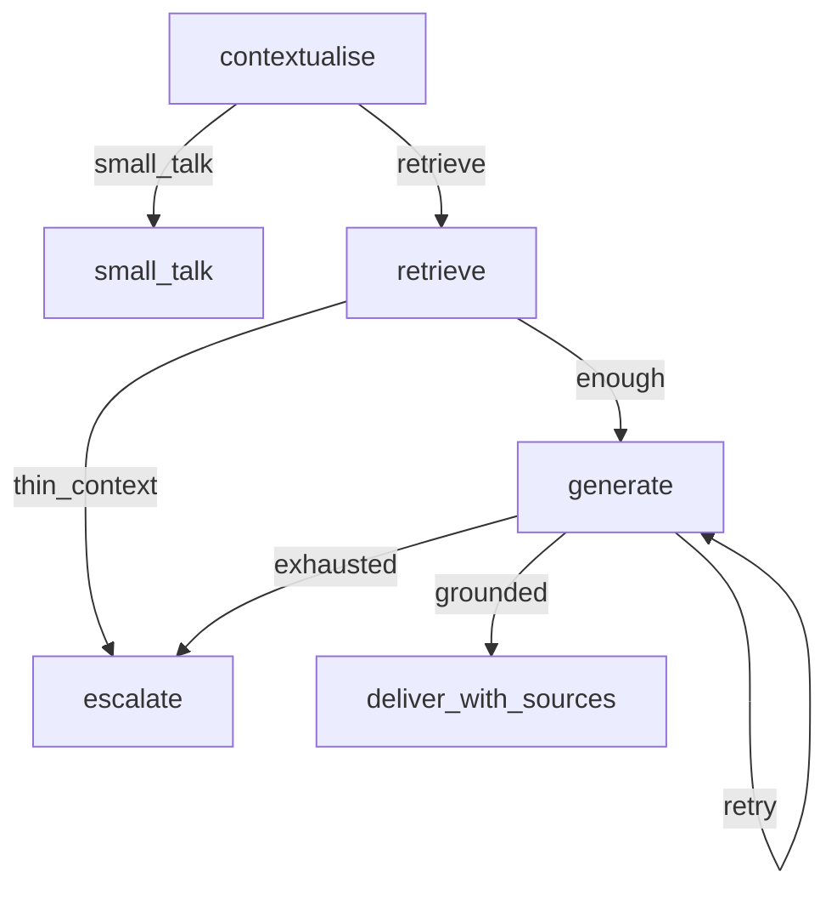

# Capstone: Policy RAG Chatbot

## 30-second answer

A grounded, cited, escalating policy assistant: ingest with citation metadata, hybrid retrieve, rewrite follow-ups, generate with mandatory chunk-id citations, verify grounding (and citation validity), escalate when evidence is thin or verification fails, and score **correct refusals** harder than raw accuracy. The eval harness makes prompt/retrieval changes measurable. This chapter is the design story — not a code dump.

## Tiny example

Employee asks "How many sick days?" then "Do I need a certificate for those?" Contextualise rewrites the follow-up. Answer cites `[leave_policy.txt#3]`. Pet insurance question → escalate / refuse. HALLUCINATED count is the ship gate.

## Why it exists

"Ask the handbook instead of emailing HR" ships embarrassing invent-policy bots without citations, grounding, escalation, and refusal evals. Nothing here is new machinery — everything is deliberate assembly.

## Runtime



*Picture:* rewrite → retrieve → generate with cites → verify or escalate. Never invent policy.

**Citations:** at chunking stamp `chunk_id` (`source#index`) and human `citation`. Prompt requires `[chunk_id]` after claims. `citations_valid` checks every bracketed id exists in context.

**Escalation:** thin retrieval (`< MIN_RELEVANT_CHARS`) → escalate. Failed grounding after attempts → escalate.

**Supporting choices:** heading-aware split; hybrid EnsembleRetriever (MMR + BM25); SqliteSaver (Postgres in multi-replica); status streaming; corpus version manifest; conversation keys `user:{id}:conv:{id}` from auth.

**Eval:** answerable facts + must-refuse cases. Protect HALLUCINATED when tuning accuracy.

## Objects, fields, and merge rules

| Field | Role |
|---|---|
| `question` | Standalone rewritten query |
| `documents` | Retrieved chunks |
| `citations` | Human-facing sources |
| `attempts` | Append regen budget |
| `escalate` | Refusal path taken |
| `trace` | Operational breadcrumb |

## Control surface

- Metadata at ingest is non-negotiable for citations.
- Treat grounding as a verification node, not a prompt hope.
- Eval set mixes answerable and must-refuse.
- Conversation ids from auth, never raw client names alone.

## Failure anatomy

| Failure | Fix |
|---|---|
| Uncitable answer | Stamp citation at chunk time |
| Follow-up nonsense | Contextualise rewrite |
| Confident invent | Verify + escalate |
| Accuracy up, safety down | Watch HALLUCINATED count |

## Keywords

- **chunk_id citations** — stable `source#index`
- **grounding + citations_valid** — verify before deliver
- **escalate** — thin evidence or failed verify
- **HALLUCINATED metric** — ship gate for refusals
- **auth-bound conversation id** — `user:…:conv:…`

## Minimal fragment

```python
# ingest: metadata chunk_id="leave_policy.txt#3", citation="Leave Policy §3"
# contextualise → retrieve → if thin: escalate
# generate with required [chunk_id] cites → grounded + citations_valid?
#   yes → deliver with Sources line
#   no, attempts left → regenerate
#   no, exhausted → escalate
# eval: compare naive RAG vs chatbot on HALLUCINATED + fact hits
```

## Interview traps

**Shallow:** "Citations are just a prompt instruction."

**Correction:** Stamp ids at ingest, require brackets, validate ids against context.

**Shallow:** "Optimise for accuracy on answerable questions only."

**Correction:** Protect correct refusals. HALLUCINATED is the ship metric.

## Lab

[51_policy_rag_chatbot.ipynb](../../08-capstones/51_policy_rag_chatbot.ipynb)
