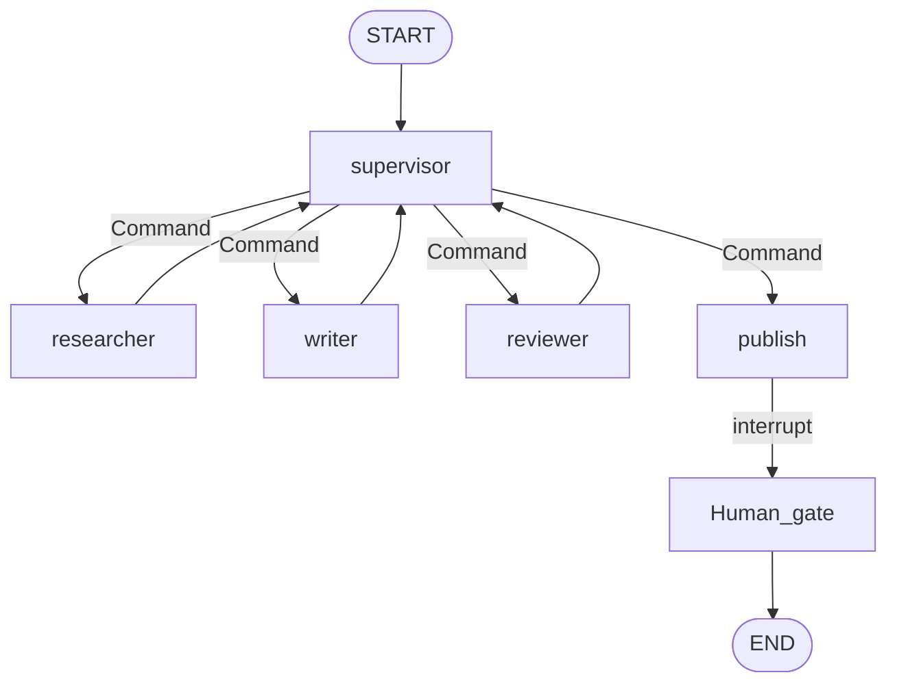

# Capstone: Multi-agent Research Desk

## 30-second answer

A supervisor routes researcher → writer → reviewer → publish, but **budgets and most routing rules live in code**, not prompts: `MAX_RESEARCH_CALLS`, `MAX_REVISIONS`, approve-with-changes coerced to revise, and revise/review alternation from counts. The researcher is an isolated agent; only structured findings cross the boundary. `interrupt()` — pause and wait for a human click — gates publishing. Multi-agent costs 5–10× a single call — prove it beats a baseline before you keep it.

## Tiny example

Brief: "Positioning vs three competitors." Supervisor sends researcher (tools, call limit) → writer drafts from findings only → reviewer rubric → maybe revise → publish pauses for human approve/reject/edit. Cap research calls at 6 and revisions at 2 in Python.

## Why it exists

Roles benefit from *not* seeing each other's working. Multi-agent systems most often go wrong here: agents talk in circles, the reviewer approves everything, costs triple. This capstone builds the desk **and** the controls that keep it honest.

## Runtime



*Picture:* supervisor in the middle; publish pauses for a human click.

**Hard rules (model does not vote):**

1. `revisions >= MAX_REVISIONS` and draft exists → publish
2. Latest critique `approve` → publish
3. If draft exists: alternate writer/reviewer from counts — no model call
4. Ambiguous call only: researcher vs writer when there is no draft yet
5. Model picks researcher but `researcher_calls >= MAX` → force writer

**Isolated researcher:** parent sees structured `Finding` list only.

**Reviewer:** if `approve` and `required_changes` non-empty → coerce to `revise`.

**Human gate:** `interrupt({action, draft, options})`; resume approve / reject / edit.

Honesty: cost meter; single-shot baseline; first-pass approval rate alert.

## Objects, fields, and merge rules

| Field | Merge | Role |
|---|---|---|
| `findings` / `critiques` | append | Structured claims / review history |
| `revisions` / `researcher_calls` | append | Budgets |
| `draft` / `published` | replace | Current brief / gate outcome |

## Control surface

- Encode precise rules in Python; reserve the model for irreducible judgement.
- Show outstanding changes when revision cap forces publish.
- Compare cost and quality to a single-shot baseline.
- Cache findings and house style in the store (49).

## Failure anatomy

| Failure | Fix |
|---|---|
| Infinite handoffs | Hard stops + recursion_limit |
| Rubber-stamp | Rubric + findings + coerce |
| Runaway research | MAX_RESEARCH_CALLS |
| Context pollution | Isolated researcher |
| Silent cost blowout | CostMeter per conversation |

## Keywords

- **budgets in code** — model proposes; code disposes
- **supervisor + Command** — central routing
- **isolated researcher** — findings only
- **interrupt before publish** — pause and wait for a human click
- **approve-with-changes → revise** — coerce in code

## Minimal fragment

```python
# supervisor returns Command(goto=..., update={trace})
# if revisions >= MAX_REVISIONS: goto publish
# if draft: alternate writer/reviewer from counts (no LLM)
# researcher: create_agent + ModelCallLimitMiddleware → extract Finding list only
# publish: interrupt({...}); resume "approve" | {"action": "reject"} | {"action": "edit", "draft": ...}
```

## Interview traps

**Shallow:** "Let the supervisor LLM decide every hop including budgets."

**Correction:** First desk that did that hit recursion thrash. Every precise rule belongs in code.

**Shallow:** "Rejection means the desk failed."

**Correction:** Rejection means the human gate worked.

## Lab

[52_multi_agent_research_desk.ipynb](../../08-capstones/52_multi_agent_research_desk.ipynb)
