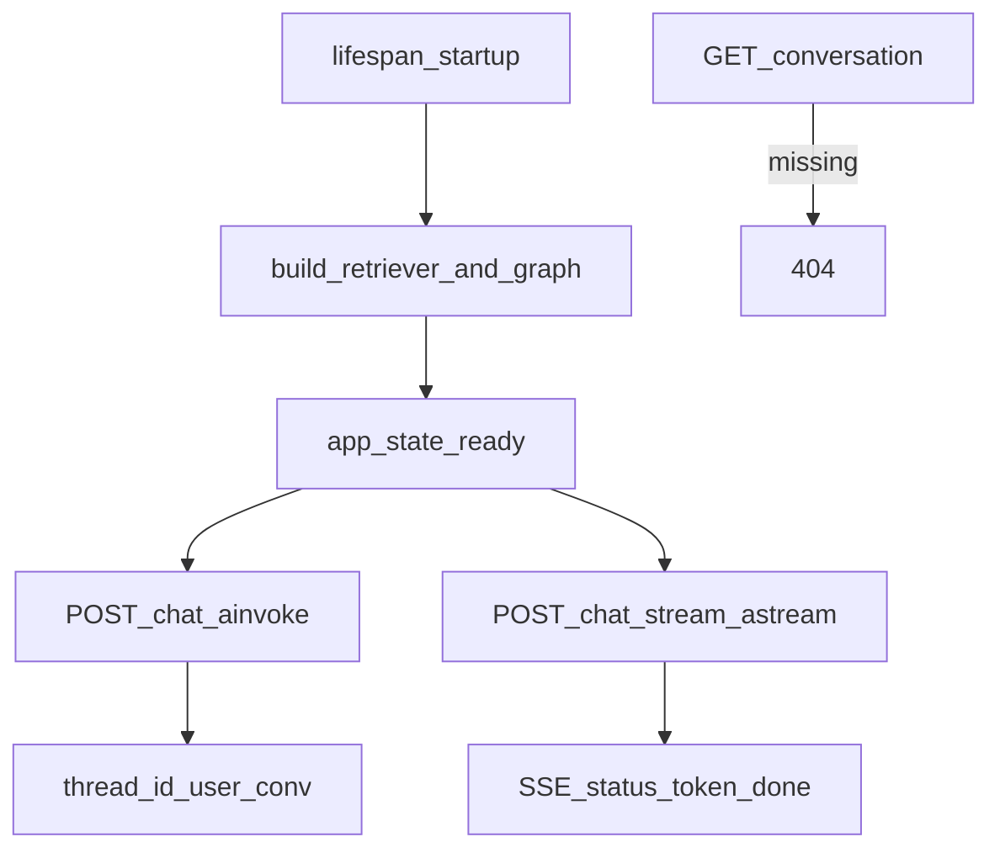

# Capstone: FastAPI + LangGraph Service

## 30-second answer

Compile the graph **once in lifespan**, not per request. Derive `thread_id` as `{user_id}::{conversation_id}` so cross-user access is impossible by construction — lookups return **404, not 403**. That is **FastAPI user isolation 404**. Use `ainvoke` / `astream` so concurrency overlaps. SSE streams must end with a terminal `done` (or `error`) event; stop on client disconnect.

## Tiny example

Alice chats with conversation id `c1` → thread `alice::c1`. Bob GETs Alice's conversation → empty state → **404**. Returning 403 would confirm the resource exists. Same conversation id string for Bob is a different save game.

## Why it exists

Notebooks are single-user and one request at a time. A service needs concurrent requests, shared checkpointers, streaming to browsers that disconnect, auth-bound conversations, and honest health checks.

## Runtime



*Picture:* build once at startup; every request uses an auth-bound conversation id; missing → 404.

1. Factory `build_graph(retriever, model, checkpointer)` — no import-time index build.
2. Lifespan: compile once onto `app.state`; set ready; clear on shutdown.
3. API key → `user_id`. Client `conversation_id` is untrusted alone.
4. `thread_id_for(user_id, conversation_id)` embeds the user.
5. Endpoints: `/health`, `POST /chat`, `POST /chat/stream`, GET/DELETE `/conversations/{id}`.
6. Sync `invoke` blocks the event loop — use async.
7. SSE: `start`, `status`, `token`, then **`done`** or `error`. Headers: `Cache-Control: no-cache`, `X-Accel-Buffering: no`.
8. Production: PostgresSaver, one worker per container × replicas, timeouts, LangSmith version tags.
9. Tests: `httpx.ASGITransport` + lifespan — assert cross-user GET is 404.

## Objects, fields, and merge rules

| Contract | Role |
|---|---|
| `ChatRequest.conversation_id` | Optional client id; untrusted alone |
| `thread_id_for` | Auth-bound checkpointer key / conversation id |
| `app.state.graph` | Process singleton from lifespan |
| SSE events | start, status, token, done, error |

## Control surface

- Factory builds graph once inside lifespan.
- Validate with Pydantic (empty → 422; missing key → 401).
- Always emit terminal SSE; stop on disconnect.
- Tag traces with `graph_version`.

## Failure anatomy

| Failure | Cause | Fix |
|---|---|---|
| Serialised users | Sync `invoke` | `ainvoke` / `astream` |
| Cross-user read | Thread id = conversation id only | Embed `user_id` |
| Existence leak | 403 on others' threads | **404** |
| Browser hangs | No terminal SSE | Emit `done` |
| Rebuild storm | Index at import / per request | Lifespan once |
| Lost threads on deploy | InMemorySaver | PostgresSaver |

## Keywords

- **lifespan singleton** — compile once
- **FastAPI user isolation 404** — auth-bound conversation id; missing → 404 not 403
- **`ainvoke` / `astream`** — non-blocking concurrency
- **terminal SSE `done`** — finished vs died
- **PostgresSaver in prod** — shared across replicas

## Minimal fragment

```python
def thread_id_for(user_id: str, conversation_id: str) -> str:
    return f"{user_id}::{conversation_id}"

# lifespan: build retriever + graph once; app.state.ready = True
# POST /chat: await graph.ainvoke(..., config={"configurable": {"thread_id": thread_id_for(...)}})
# GET /conversations/{id}: empty state → HTTP 404 (never 403)
# SSE: yield data lines; always end with done or error; check request.is_disconnected()
```

## Interview traps

**Shallow:** "Return 403 when Bob reads Alice's conversation."

**Correction:** **404**. Do not confirm the resource exists. Isolation falls out of the key design.

**Shallow:** "Compile the graph per request so it is fresh."

**Correction:** Lifespan once. Per-request compile and import-time indexes destroy startup and concurrency.

**Shallow:** "Sync invoke is fine under FastAPI."

**Correction:** It blocks the event loop. Use `ainvoke` / `astream`.

## Lab

[53_fastapi_langgraph_service.ipynb](../../08-capstones/53_fastapi_langgraph_service.ipynb)
